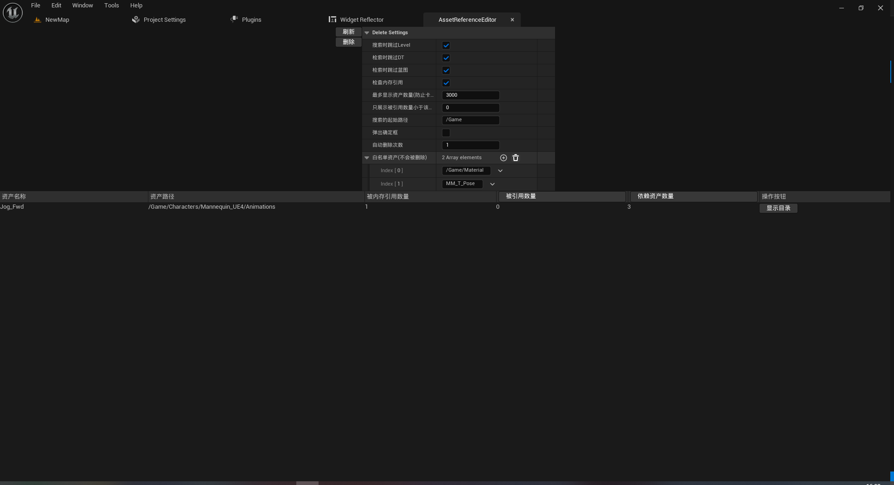
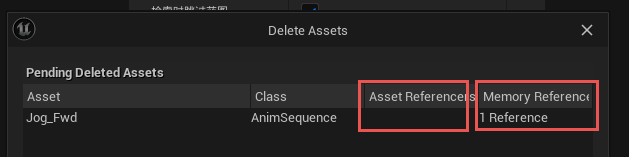
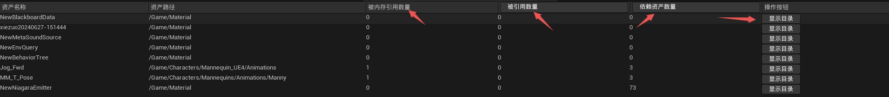

# Asset Reference Editor

基于 UE_5.3 的建议资产索引删除工具

## 关于参数

- 搜索时跳过 `Level`

一般来说 `Level` 都是没有被引用的，所以需要一般跳过 `Level` 

- 搜索时跳过 DT

一般来说 `DataTable` 中会配置很多数据，但是有可能在蓝图中没有使用，在 C++ 中使用，所以 `DataTable` 可以被跳过

- 搜索时跳过蓝图

如果不想删除可能会用到的蓝图资产，比如 `BP_ThirdCharacterPerson` 需要勾选

TODO: 以 `EQS` 为例，它不是 `Blueprint` 资产，所以会被删除，但是这个不应该被删除，初次之外还有很多其他类型不期望被删除，后续需要添加

- 检查内存引用

通过 `Reference Viewer` 显示资产的**引用**和**依赖**关系，但是会存在内存引用，内存引用不会显示在 `Reference Viewer` 中

在删除资产时会对存在**内存引用**的资产进行删除提示

进行**内存引用**搜索会加载这个资产，**加载** + **搜索** 会导致整个显示流程会等待非常长的时间

如果想要暴力删除没有索引的资产，不要勾选

- 最多显示资产数量

避免 `ListView` 显示最大数量，防止数量过多爆内存或者太长的计算时间

- 只展示被应用数量该值

避免 `ListView` 显示最大数量，防止数量过多爆内存或者太长的计算时间

一般来说要删除的都是没有被引用的资产，所以默认值为 0

- 搜索的起始路径

一般需要进行资产删除的都是 `Art` 美术资产，程序资产一般不大，或者不多。鉴于以上原因，添加路径索引的限制，通过 `/Game/Art` 配置就能只搜索 `Content/Art` 目录中的资产

- 弹出确认框

在调用引擎的删除逻辑时，可以传入是否确定删除的框，这个框一个是再次检查文件引用关系(包括**资产引用**和**内存引用**)，一个是提供强制删除的按钮

如果不在意内存引用，可以勾选弹出确认框，强制删除资产

由于**弹出确认框**会再次计算引用关系，也就意味着加载资产和搜索引用，需要耗费比较长的时间

- 自动删除次数

对 `A` 引用 `B`，`B` 引用 `C`，`C` 引用 `D` 的情况，删除了 `A` 之后 `B` 就没有引用了，这个时候需要删除 `B`，删除 `B` 之后需要删除 `C`

对于上述这种链式引用，我懒得写递归删除的逻辑，直接加一个**自动删除次数**的配置，当点击删除按钮时，会指定指定次数的删除操作

也就是说，如果配置该值为 4，会执行 4 次删除逻辑，也就会把上述例子的 `A`、`B`、`C`、`D` 都删除掉 

- 白名单资产

对于一些资产，配置在 ini 或者 脚本 中，它没有被其他蓝图资产引用，所以它的引用数目为 0

不希望这些资产被删除的话，需要设置白名单

如上图所示的例子

如果 `/Game/Material` 这种以 `/Game` 开头的字符串，表示文件夹白名单

如果 `MM_T_Pose` 这种普通字符串，则表示名字为 `MM_T_Pose` 的单个资产不要被删除

## 关于显示

除了资产名称、资产路径之外，再就是**内存引用数**、**资产引用数**、**依赖资产数**和**操作按钮** 四列

除了显示基本的引用数量信息外，还可以点击 **资产引用数**、**依赖资产数** 进行从小到大的排序

点击 **显示目录** 可以自动在 `Content Browser` 中显示该资产所在路径